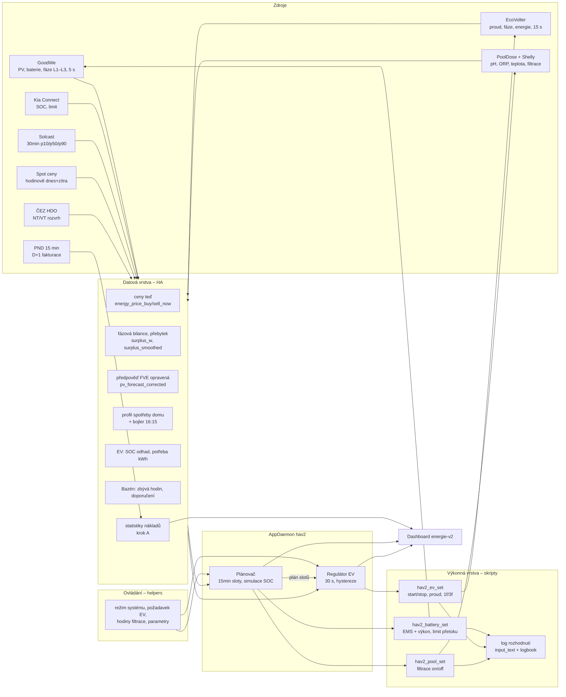
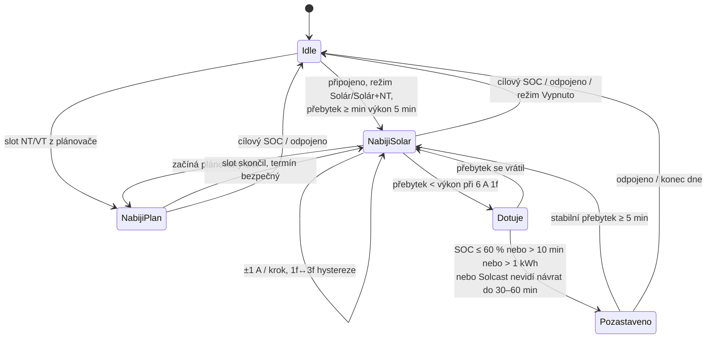

# HAv2 – návrh architektury řízení energie (Fáze 2)

> Stav: **schváleno 2026-09-25** (rozhodnutí v §11). Hotovo: statistiky (krok A, `config/packages/hav2_statistics.yaml`) a **datová vrstva + helpery** (Fáze 3 krok 1, `hav2_data.yaml`, `hav2_helpers.yaml`, `custom_templates/hav2.jinja`). Režim systému je „Jen doporučení“.
> Zadání je v `docs/HAv2_prompt.md`. Záloha v1 a pravidla mazání jsou v `archive/v1-2026-09-25/README.md`.

## 1. Cíl a principy

**Cíl:** minimální denní náklady = Σ fází (nákup × cena NT/VT) − Σ fází (prodej × spot × 0,85).

Principy vycházejí z měření ve Fázi 1:

| Princip | Proč |
|---|---|
| Nákup a prodej se vždy počítají **po fázích** (`meter_active_power_l1..l3`, `sensor.energy_buy/sell`) | ČR účtuje každou fázi zvlášť. Součtové čítače GoodWe se nepoužívají. |
| Kontrola proti **PND (D+1, 15 min)** | Fakturační pravda. GoodWe nevidí bojler. |
| Střídač se řídí jen přes **EMS režim + výkon** a limit přetoku v povolených rozsazích | Otestováno 25. 9. Bezpečnost baterie má přednost před úsporou. |
| Předpověď FVE = **Solcast × sezónní a hodinové koeficienty** | Solcast nadhodnocuje o 24–34 %, odpoledne je stín. |
| Každé rozhodnutí se zapíše (kdo, co, proč) | Dohledatelnost a ladění. |
| Ruční zásah má vždy přednost a **sám vyprší** | Systém nesmí „bojovat“ s uživatelem. |

**Klíčová zjištění z Fáze 1, na kterých návrh stojí:**
- **GoodWe GW10K-ET je asymetrický.** Dorovnává fáze a na jednu fázi dá až ~4,1 kW. Souběžný nákup a prodej je ~0,5 kWh/den, převážně při SOC < 95 %.
- **EMS režimy:** `battery_standby` = baterie stojí, `charge_battery X` / `discharge_battery X` = přesně X W, `sell_power` / `buy_power X` = cílový tok do/ze sítě. Odezva je 5–10 s. **`conserve` nabíjí i ze sítě, proto se nepoužívá.**
- **EcoVolter:**
  - 1f je vždy na L1.
  - Auto odebírá méně, než je nastaveno: 6 A → 1,27 kW, 8 A → 1,55 kW, 10 A → 1,98 kW (1f). 3f 6 A → 4,17 kW (~0,69 kW/A).
  - Přepnutí 1f↔3f funguje **za běhu** (~20 s).
  - Odezva na změnu proudu je 15–20 s, start ~20 s.
  - Wallbox občas vypadne na 20–70 s (`unavailable`).
- **Kia:** SOC bývá staré i hodiny. Připojení a nabíjení se berou z EcoVolteru, SOC z Kia po `force_update` a dál se dopočítává.
- **Čerpadlo filtrace:** L2, ~500 W. Shelly měří jen cívku stykače.
- **Bojler (WATrouter ECO, 2,2 kW, 1f na L3) je mimo měření GoodWe.** Každý den od **16:09** nucený ohřev (75–170 min), podle PND 12.–25. 9. **2,6–6,4 kWh/den, průměr 4,2 kWh a 22 Kč/den**, téměř vše VT. Baterie ho nepokryje. Pravděpodobná příčina zapojení: historický okruh na HDO odbočující před měřením GoodWe.
- **Solcast:** časování sedí. Koeficienty: duben–září ×0,80, březen/říjen ×0,75, únor ×0,68, listopad–leden ×0,50. Odpoledne za jasna: 16 h ×0,70, 17 h ×0,55, 18 h ×0,40.

## 2. Architektura a tok dat

Tři vrstvy, oddělené přes pomocníky (helpers) v HA:

1. **Datová vrstva (HA šablony a statistiky):** vyčištěné vstupy (ceny, fáze, přebytek, předpovědi, stav EV a bazénu).
2. **Rozhodovací vrstva (AppDaemon app `hav2`):**
   - **plánovač:** 15min sloty na dnešek a zítřek,
   - **regulátor proudu EV:** smyčka po 30 s.
   - Výsledky publikuje jako senzory `sensor.energy_plan`, `sensor.ev_regulator` atd.
3. **Výkonná vrstva (HA skripty `script.hav2_*`):** jediné místo, které sahá na střídač, wallbox a filtraci. Hlídá povolené rozsahy, loguje a respektuje režim systému (Auto / Jen doporučení / Ručně / Dovolená).

### Proč AppDaemon, a ne čisté HA automatizace
- Plánování slotů (simulace SOC přes 36 h, výběr nejlevnějších slotů) a stavový automat regulátoru EV by v Jinja byly nečitelné a netestovatelné. V Pythonu jdou pokrýt **unit testy** v repu.
- AppDaemon už běží (PND app), takže nic nového se neinstaluje.
- **HA zůstává zdrojem pravdy a ovládání:** všechny parametry jsou v HA helperech a všechny akce jdou přes HA skripty, takže jsou vidět v logbooku a trace. Když AppDaemon spadne, watchdog v HA přepne na bezpečný stav (viz §7).
- Alternativa (vše v HA automatizacích) je popsaná v §11. **Rozhodnutí potřebuji od tebe.**

## 3. Datová vrstva (nové šablony a senzory)

Z kroku A už existuje: ceny teď, fázová bilance, souběžný nákup+prodej, náklady/výnosy, EV náklady podle zdroje, hodnota energie v baterii a porovnání s PND.

| Entita | Co počítá | Obnova |
|---|---|---|
| `sensor.energy_surplus_w` | Přebytek pro řízené spotřebiče = PV − (dům bez EV a filtrace). Kladný = k dispozici. Nabíjení baterie se počítá jako „k dispozici“ jen tehdy, když plán baterii nepotřebuje. | 5 s |
| `sensor.energy_surplus_smoothed_w` | Klouzavý průměr 90 s (statistics helper) | 5 s |
| `sensor.energy_phase_headroom_l1..l3_w` | Kolik jde na fázi přidat bez nákupu. Když baterie může dorovnávat: celkový přebytek. Když je plná nebo prázdná: přetok dané fáze. | 5 s |
| `sensor.energy_pv_forecast_corrected` | Solcast p50 × sezónní × hodinový koeficient. Stav = zbytek dne (kWh). Atributy: 15min sloty dnes a zítra, `tomorrow_kwh`, `conservative_kwh`. | při změně Solcastu |
| `sensor.energy_load_forecast` | Profil spotřeby domu po hodinách (medián 14 dní, pracovní den / víkend) + **bojler** (16:09, energie = průměr PND−GoodWe za 7 dní). Atributy: 15min sloty. **Počítá AppDaemon** (šablony neumí číst dlouhodobé statistiky). | 1× denně + půlnoc |
| `sensor.energy_breaker_headroom_a` | Rezerva hlavního jističe 25 A na nejzatíženější fázi (odběr ze sítě / 230 V, na L3 + 9,8 A při ohřevu bojleru), atribut `worst_phase` | 5 s |
| `sensor.energy_value_pv_now` | Hodnota kWh z FVE teď = max(spot × 0,85, 0) | hodinově |
| `sensor.ev_soc_estimate` | SOC Kia při připojení (po `force_update`) + nabitá energie × účinnost / 77,4 kWh | 15 s |
| `sensor.ev_energy_needed_kwh` | (cíl − odhad SOC) × 77,4 / účinnost nabíjení (90 %) | 15 s |
| `sensor.ev_deadline_slack_h` | Rezerva do termínu: čas do deadlinu − čas potřebný při max. výkonu | 1 min |
| `sensor.pool_hours_done_today` | Hodiny filtrace v „bazénovém dni“ 06:00–06:00 (history_stats) | 1 min |
| `sensor.pool_hours_recommended` | Teplota vody / 2 (jen po 10 min běhu), +1 h při ORP < 650 mV, min/max z helperů | při změně |
| `binary_sensor.energy_boiler_heating` | Bojler hřeje (v reálném čase): napěťový index (L1+L2)/2 − L3 (při nabíjení EV v 1f jen L2 − L3), 5min průměr. Zapnout od 1,0 V v okně nuceného ohřevu 16–19 h, jinak od 2,5 V, vypnout pod 0,5 V, jen 12–20 h, delay_off 3 min. Kalibrováno proti hodinovým datům PND 16.–25. 9.: denní součty ±1 kWh, po hodinách chyba ~17 kWh / 10 dní (střídač s nesymetrickým výkonem napětí ruší). Slouží k rezervě proudu na L3 a k započtení bojleru do přebytku. | 5 s |
| `sensor.energy_boiler_pnd_daily` | Bojler za poslední den z PND (hodiny, kdy PND − GoodWe > 0,25 kWh): kWh, Kč (nákup × NT/VT), část z přetoků, součet za aktuální měsíc (`month_kwh`, `month_cost_kc`), 14denní historie a průměr; `state_class: measurement` → dlouhodobé statistiky. Také **zbytková odchylka měření HA proti PND bez bojleru** (`residual_import/export_pct`, pro senzory `energy_pnd_deviation_*`). **Počítá AppDaemon** (`hav2_boiler.py`), 07:30 a po stažení PND. | D+1 |
| `binary_sensor.energy_forecast_valid` | Solcast aktualizován < 6 h a API nevyčerpané | 1 min |

## 4. Ovládací vrstva (helpers)

Kategorie „HAv2“ a label `hav2` + oblast (`hav2_battery`, `hav2_ev`, `hav2_pool`, `hav2_system`).

| Helper | Typ | Výchozí | Popis |
|---|---|---|---|
| `input_select.energy_system_mode` | select | **Jen doporučení** | Auto / Jen doporučení (nic nepíše, jen loguje, co by udělal) / Ručně / Dovolená |
| `input_number.energy_battery_min_soc` | 10–50 % | 20 | Nepodkročitelná rezerva (nastaví i DoD = 100 − min SOC) |
| `input_number.energy_battery_max_grid_charge_w` | 0–5000 W | 3000 | Max. výkon nabíjení ze sítě v NT |
| `input_number.energy_sell_min_spot` | Kč/kWh | 7,2 | Prodej z baterie jen nad touto cenou (≈ VT/0,85) |
| `input_number.energy_export_block_below` | Kč/kWh | 0,0 | Pod touto cenou omezit přetok na 0 |
| `input_boolean.energy_boiler_preheat` | bool | off | Experiment: poledne umělý přetok pro WATrouter (§5.6) |
| `input_select.ev_mode` | select | Solár+NT | Solár / Solár+NT / Rychle / Vypnuto |
| `input_number.ev_target_soc` | 20–100 % | 80 | Cílový SOC |
| `input_datetime.ev_deadline` | datum+čas | – | „Nabito do“ (prázdné = bez termínu) |
| `input_boolean.ev_deadline_hard` | bool | off | Splnit za každou cenu (i VT) |
| `input_number.ev_current_min/max` | 6–16 A | 6 / 11 | Rozsah proudu |
| `input_number.ev_regulation_interval_s` | 30–120 s | 60 | Krok regulace |
| `input_number.ev_support_min_soc` | % | 60 | Dotování z baterie jen nad tímto SOC |
| `input_number.ev_support_max_min` / `_max_kwh` | min / kWh | 10 / 1,0 | Limit jedné epizody dotování |
| `input_number.ev_resume_after_min` | min | 5 | Obnovit nabíjení po stabilním přebytku |
| `input_boolean.ev_allow_1f` | bool | on | Povolit 1f na L1 pro malé přebytky |
| `input_boolean.pool_season` | bool | on | Sezóna bazénu (+ volitelné datum od–do) |
| `input_number.pool_hours_required` | 0–24 h | 6 | Požadované hodiny, přebije doporučení |
| `input_boolean.pool_use_recommendation` | bool | on | Použít `pool_hours_recommended` |
| `input_number.pool_min_run_min` | min | 60 | Minimální délka jednoho běhu (proti kmitání) |
| `input_number.filtrace_vykon_w` | W | 500 | Příkon čerpadla (existuje) |
| `input_datetime.energy_override_until` | datum+čas | – | Ruční override vyprší v tento čas |
| `input_select.pool_manual` | select | Auto | Auto / Zapnout / Vypnout – ruční ovládání filtrace |
| `input_number.pool_manual_duration_h` | 0,5–12 h | 2 | Jak dlouho platí ruční Zapnout/Vypnout, pak zpět Auto |
| `input_select.ev_manual` | select | Auto | Auto / Nabíjet teď / Zastavit – ruční ovládání nabíjení |
| `input_number.ev_manual_current` | 6–11 A | 11 | Proud pro „Nabíjet teď“ |
| `input_select.ev_manual_phases` | select | Auto | Auto / 1f / 3f pro „Nabíjet teď“ |
| `input_select.ev_manual_until` | select | Do odpojení | Do odpojení / Do cílového SOC / Na 1 h / Na 3 h – kdy ruční režim skončí |
| `input_text.energy_last_decision` / `ev_last_decision` / `pool_last_decision` | text | – | Poslední rozhodnutí + důvod |

Ceny a parametry baterie jsou už z kroku A (`energy_price_vt/nt`, `energy_sell_coefficient`, `energy_battery_efficiency`, `energy_battery_wear_cost`).

## 5. Logika po oblastech

### 5.1 Ekonomika jedné kWh (vstup pro všechna rozhodnutí)

| Zdroj | Cena kWh |
|---|---|
| Síť VT / NT | 6,10 / 3,51 |
| FVE teď | ušlý prodej = max(spot × 0,85, 0) |
| Baterie (výstup) | pořizovací cena / 0,9 + 1,0 opotřebení (`sensor.energy_battery_energy_value`) |
| NT → baterie → VT | 3,51 / 0,9 + 1,0 = **4,90 < 6,10** → vyplatí se, pokud se energie spotřebuje ve VT |

### 5.2 Baterie (plánovač, každých 15 min + při události)

| Situace (vstupy) | Podmínka | Akce (EMS) |
|---|---|---|
| NT, simulace ukazuje deficit ve VT | Deficit = Σ VT slotů max(0, spotřeba − FVE_konzerv.) − (SOC − min) × kapacita > 0 **a** 4,90 < 6,10 | `charge_battery` výkonem, aby cílové SOC bylo dosaženo do 06:00. Cíl = min SOC + deficit, **max. tak, aby zbylo místo pro očekávaný přetok z FVE**. |
| NT, zítra FVE baterii nabije | Simulace: SOC zítra dosáhne ≥ 95 % z FVE | `auto` (baterie smí vybíjet i v NT, dům jede z baterie) |
| NT, EV nabíjí ze sítě | Vždy | `battery_standby`, aby baterie nevybíjela do auta (dvojí cyklus) |
| VT, běžný den | – | `auto` (vlastní spotřeba) |
| VT, spot špička | spot ≥ `energy_sell_min_spot` **a** simulace: baterie se do večera dobije z FVE na plán | `discharge_battery` (výkon podle rezervy), nejvýš do plánovaného SOC |
| Záporná / velmi nízká cena | spot × 0,85 < `energy_export_block_below` | limit přetoku = 0 W **až po** vyčerpání spotřebičů: EV → bazén → baterie (+ experiment bojler) |
| Záporný výkup v poledne, dopoledne kladný | simulace i s FVE × 0,8 nabije baterii do 17:00 na ≥ 95 % **a** EV nic nechce | `defer` dopoledne: `battery_standby` (přetok do sítě za kladnou cenu), při nákupu > 300 W hned `auto`; baterie se nabije v záporných hodinách |
| SOC ≤ min SOC | kdykoli | `auto` + DoD drží rezervu (ochrana i při výpadku HA) |
| Výpadek předpovědi | `energy_forecast_valid` = off | konzervativní: FVE = poslední platná × 0,5, jinak 0 |

**Plné nabití (doplněno 26. 9.):** baterie Pylontech Force H2 × 3 (LiFePO4). Výrobce předepisuje vyrovnání
článků nabitím na 100 % aspoň jednou za 3 měsíce; BMS si ho při delší době bez plného nabití vyžádá sám přes
komunikaci se střídačem. HAv2 navíc hlídá `input_datetime.energy_battery_last_full` (automatizace při SOC ≥ 99 %)
a když baterie nebyla plná `input_number.energy_battery_full_every_days` (nastaveno 30 dní, kvůli přesnosti SOC
pro plánovač), nabije ji den před termínem v nejbližší NT na 100 % – jen když ji druhý den nenabije slunce.

**Omezení přetoku (implementace):** `Hav2._export_control` každou minutu, `sensor.energy_export_control`,
zápis přes `script.hav2_export_set` (0 / 10 000 W, jen v Auto s řízením baterie). Omezí se jen když výkup
< práh, baterie ≥ 97 % (uvolní pod 95 %), EV nic nechce, filtrace je hotová a neběží, FVE vyrábí – při limitu 0
GoodWe omezí FVE na spotřebu domu a přebytek pro EV/filtraci by klesl k nule. `automation.hav2_obnovit_limit_pretoku_po_vypnuti_rizeni`
a watchdog baterie vrací 10 000 W.

**Algoritmus:**
1. Sloty po 15 min od teď do zítřka 24:00.
2. Na každý slot se spočítá bilance: FVE_opr − spotřeba domu − bojler − plánované EV a bazén.
3. Simulace SOC. Hledá se **nejmenší NT nabití**, při kterém SOC nikdy nespadne pod min SOC dřív, než ho dobije FVE (nebo do 22:00).
4. Při dvou řešeních se stejnou cenou vyhrává menší nabití, aby zbylo místo pro slunce.

### 5.3 EV – plánovač (termín a energie)

1. **Při připojení auta:** `kia_uvo.force_update` (max. 2× denně). SOC → `ev_soc_estimate`, spočítá se `ev_energy_needed_kwh`.
2. **Rozdělení energie do slotů podle režimu:**
   - **Solár:** jen sloty s očekávaným přebytkem ≥ 1,3 kW (1f) nebo ≥ 4,2 kW (3f).
   - **Solár+NT:** nejdřív FVE sloty do termínu, zbytek NT (22–06) – v **posledním** NT bloku před termínem
     (dřív může nabíjet slunce). NT za koncem předpovědi (sloty do zítřka 24:00) a před termínem se jen rezervuje
     („NT později“) a naplánuje se, až bude v horizontu. V NT 3f 11 A ≈ 7 kW (auto bere méně, než je nastaveno), pozor na jistič (§7).
   - **Rychle:** hned, max. proud, jakákoli cena.
   - **Vypnuto:** nic.
3. **Termín:**
   - Když FVE + NT do termínu nestačí a `ev_deadline_hard` = on → doplní VT sloty (nejlevnější, nejpozději).
   - Když `ev_deadline_hard` = off → notifikace „nestihne se, chybí X kWh“ s volbou doplnit.
4. **Regulace podle přebytku běží jen tehdy, když je termín bezpečně splnitelný** (`ev_deadline_slack_h` > 1 h). Jinak plánovač vynutí pevný proud.

### 5.4 EV – regulační smyčka proudu (solární nabíjení)

**Vstupy:** `energy_surplus_smoothed_w` (90 s), fázová rezerva, SOC baterie, Solcast na dalších 30–60 min, stav wallboxu.

**Krok:** 1× za `ev_regulation_interval_s` (výchozí 60 s, min. 30 s kvůli odezvě 15–20 s), max ±1 A.

**Přepočet výkon ↔ proud** podle naměřené tabulky:

| Fáze | 6 A | 7 A | 8 A | 10 A | 11 A |
|---|---|---|---|---|---|
| 1f (L1) | 1,27 kW | ~1,40 | 1,55 | 1,98 | ~2,15 |
| 3f | 4,17 kW | ~4,4 | ~5,0 | ~6,3 | ~7,0 |

Tabulka se průběžně zpřesňuje z naměřených hodnot.

**Volba fází (hystereze):**
- 1f → 3f, když vyhlazený přebytek > 4,6 kW po dobu 3 min.
- 3f → 1f, když < 3,9 kW po dobu 3 min.
- Přepnutí max. 1× za 10 min, jde to za běhu.

**Hystereze proudu:**
- zvýšit o 1 A, když rezerva > výkon dalšího kroku + 150 W,
- snížit o 1 A, když rezerva < −100 W.

**Dotování z baterie:** pokrývá výpadek při mracích, jen když SOC > `ev_support_min_soc` a Solcast na 30–60 min slibuje návrat. Limit 10 min / 1 kWh na epizodu. Po překročení: 6 A, pak pozastavit.

**Plná baterie domu:** EV má přednost před prodejem až do 11 A.

**3f z plné baterie (doplněno 26. 9.):** když má baterie ≥ 90 %, výkup je < 1 Kč/kWh a opravená FVE ji do večera dobije (rezerva 2 kWh), nabíjí se 3f na minimum i při přebytku od ~3,2 kW. Rozdíl do 1 kW kryje baterie, a to bez limitu epizody 10 min / 1 kWh. Přepnutí na 1f až pod ~3,2 kW. Důvod: přetok za ~0 Kč je horší než kWh pro EV, která by se jinak v noci koupila za NT.

### 5.5 Filtrace bazénu

- **Bazénový den je 06:00–06:00**, aby se zbývající hodiny daly doplnit v celém NT bloku 22–06 (jinak by do konce kalendářního dne zbyly jen 2 h NT). *K odsouhlasení.*
- **Cíl hodin:** `pool_hours_required`, nebo při zapnutém doporučení `pool_hours_recommended` (teplota / 2, +1 h při ORP < 650 mV).
- **Přednostně z FVE:**
  - Zapnout, když vyhlazený přebytek ≥ 600 W po dobu 5 min (čerpadlo 500 W na L2; asymetrie střídače fázi pokryje).
  - Běží **min. 60 min**, pak vypnout, když přebytek < 200 W po dobu 10 min.
  - Max. 4 starty denně.
- **Doplnění:**
  - Ve 21:30 plánovač spočítá chybějící hodiny a naplánuje je do NT (od 22:00 v jednom bloku).
  - Když chybí víc než 8 h NT → zbytek jde do nejlevnějších VT slotů dalšího dne před 06:00. Takový stav nastane jen při extrémně nastavené hodnotě a hlásí se notifikací.
- **Konflikt s baterií:** když FVE přes den nestačí na obojí, porovná se úspora:
  - filtrace teď ze slunce ušetří 0,5 kW × (NT cena, kdy by jinak běžela),
  - baterie teď ušetří 0,5 kW × (VT − hodnota baterie).
  - Vybere se větší úspora.

### 5.6 Bojler (WATrouter) – experiment, výchozí stav vypnuto

- WATrouter nelze řídit ani nastavit. V 16:09 hřeje ze sítě, protože voda není teplá. Teplá voda je potřeba 18–22 h, přesun nuceného ohřevu do NT proto **nepřichází v úvahu** (rozhodnutí uživatele 26. 9.).
- **Skutečnost podle PND (12.–25. 9.):** průměr 4,2 kWh a 22 Kč/den, 25. 9. 6,36 kWh a 38 Kč (16:07–18:55 skoro nepřetržitě).
- **Varianta s elektrikářem:** přepojit okruh bojleru za měřicí transformátory GoodWe → ohřev 16–19 h kryje baterie nabitá ze slunce (odhad 5–8 tis. Kč/rok, upřesnit z delší řady PND).
- **Hypotéza:** když v poledne vznikne na síti přetok ~2,3 kW, WATrouter ho pošle do bojleru. Voda pak bude v 16:15 teplá a nucený ohřev bude krátký.
- **Test (1 slunečný den, `energy_boiler_preheat` = on):**
  - 11:00–14:00, baterie ≥ 90 %, FVE_opr > 4 kW → `sell_power` 2300 W po dobu 90 min.
  - Druhý den se výsledek změří z PND 15 min (energie v 16:15–19:00 proti průměru).
- **Když to funguje:** plánovač to zařadí jako spotřebič s prioritou před prodejem do sítě. Očekávaná úspora je 15–25 Kč/den.

### 5.7 Priority spotřeby přebytků (navrhuji tuto úpravu výchozího pořadí)

1. Dům (včetně bojleru – ten nejde ovlivnit).
2. EV s termínem, který by jinak nestihl.
3. Baterie domu, pokud ji předpověď do večera nenabije.
4. Filtrace bazénu do splnění hodin.
5. *(experiment)* předehřev bojleru přes WATrouter.
6. EV nad rámec cíle (do limitu SOC, max. 11 A).
7. Prodej do sítě.

**Zdůvodnění:** bod 5 je před bodem 6, protože kWh v bojleru ušetří VT (6,10). EV nad cíl nic neušetří, jen nabije dopředu.

## 6. Plánovací algoritmus (souhrn)

| | |
|---|---|
| Horizont | teď → zítra 24:00, sloty 15 min |
| Spouštění | každých 15 min; dále při připojení EV, změně požadavku, novém Solcastu, zítřejších spotových cenách (~13:00), přepnutí NT/VT, změně režimu |
| Vstupy | FVE_opr (p50, konzervativně p50 × dolní koeficient), spotřeba domu + bojler, ceny (spot hodinově → 4 sloty), HDO rozvrh, SOC baterie, EV potřeba a termín, hodiny bazénu |
| Postup | 1) povinné zátěže (dům, bojler) → 2) EV s termínem (nejlevnější sloty, které stihnou) → 3) simulace SOC a NT nabití → 4) bazén do přetoků, zbytek NT → 5) prodej a experimenty → 6) kontrola jističe po slotech |
| Výstup | `sensor.energy_plan`: stav = shrnutí, atributy = sloty `{start, baterie, ev_a, ev_faze, pool, ocekavany_import, cena}`. Dále `sensor.energy_plan_cost_today/tomorrow` a `energy_last_decision`. |
| Chyby | výjimka v plánovači → poslední platný plán se drží max. 1 h, pak bezpečný stav (§7) |

## 7. Výjimky a bezpečnost

| Situace | Chování |
|---|---|
| Výpadek Solcastu / vyčerpané API | konzervativní režim: poslední platná předpověď × 0,5, po 12 h počítat s FVE = 0 (NT nabití se vypočte jako v zimě) |
| Výpadek Kia API | SOC odhad z nabité energie. Když SOC není vůbec → plán podle nastavené energie „dobít X kWh“ a notifikace. |
| Auto není doma / nepřipojené | plán EV se zruší, regulace stojí |
| EcoVolter `unavailable` | smyčka nedělá nic, po obnovení pokračuje. Po > 5 min notifikace. |
| Záporné ceny | viz 5.2 a priority, limit přetoku 0 až po spotřebičích |
| Přepnutí NT → VT během nabíjení EV v NT | na konci NT slotu: EV přejde na solární regulaci nebo stop, baterie `auto` |
| **Hlavní jistič 3×25 A** (potvrzeno) | kontrola fázového proudu ze sítě každých 5 s. Když některá fáze > 23 A (~5,3 kW) po dobu 10 s → EV −2 A okamžitě, případně stop. **Bojler (9,8 A) je na L3** (určeno z poklesu napětí `on_grid_l3_voltage` o 2,3–3,7 V každý den v 16:09). Je mimo měření GoodWe, takže na L3 platí po dobu ohřevu rezerva 10 A. EV 3f 11 A + bojler = 20,8 A na L3, zbývá ~4 A na dům. Proto při ohřevu bojleru EV v 3f max. 8 A, případně 1f (L1). |
| Okruhové jističe 16 A | EV max. 11 A (strop `max_current` ve wallboxu) je pod 16 A. Ostatní okruhy systém neřídí. |
| Ruční zásah (přepnutí EMS, wallboxu nebo filtrace mimo systém) | detekce přes `context` (změna nepocházela ze `script.hav2_*`) → override do `energy_override_until` (výchozí +2 h), pak návrat |
| AppDaemon neběží (heartbeat > 3 min) | HA automatizace watchdog: EMS `auto`, EV 6 A/stop podle termínu, filtrace podle rozvrhu NT, notifikace |
| Restart HA | skripty jsou idempotentní, plánovač po startu přepočítá a znovu nastaví stav |
| Mimo povolené rozsahy | výkonné skripty odmítnou: EMS jen {auto, battery_standby, charge_battery, discharge_battery, sell_power}, výkon 0–5000 W, limit přetoku 0–10000 W, DoD 50–90 %, EV 6–11 A |

## 8. Pojmenování a organizace

- **Prefix:** `energy_*` (systém, baterie, ceny), `ev_*`, `pool_*`. Skripty `script.hav2_*`, automatizace `hav2_*` (id i alias „HAv2 – …“).
- **Label:** `hav2` na všem novém + kategorie „HAv2 – Systém / Baterie / EV / Bazén“.
- **Soubory:**
  - `config/packages/hav2_*.yaml` (statistiky, datová vrstva, helpery, skripty, watchdog),
  - `config/appdaemon/apps/hav2/` (plánovač, regulátor),
  - testy v `tests/hav2/`.
- **Každá automatizace:** `description`, uvážený `mode` a zápis rozhodnutí do `input_text` + `logbook.log`.

## 9. Dashboard `energie-v2` (samostatný, stávající zůstane)

| Stránka | Obsah |
|---|---|
| Přehled | power-flow-card-plus (FVE / baterie / síť po fázích / dům / EV / bazén), cena nákup/prodej teď, NT/VT, režim systému, poslední rozhodnutí, aktivní override |
| Plán | apexcharts: FVE_opr + Solcast p10–p90, spot dnes a zítra, HDO pásma, plánované sloty (baterie, EV, bazén), simulace SOC |
| EV | **ruční ovládání nahoře:** Nabíjet teď / Zastavit / Auto, proud, fáze, doba platnosti. Pod tím požadavek (cíl, termín, za každou cenu), režim, stav regulátoru, proud a fáze, dotování, energie session podle zdroje |
| EV náklady | session (kWh, Kč, Kč/kWh, zdroje), měsíc a rok, úspora proti VT, graf denních nákladů podle zdroje, cena / 100 km |
| Bazén | **ruční ovládání nahoře:** Zapnout / Vypnout / Auto + doba platnosti. Pod tím sezóna, hodiny splněno / cíl / doporučení, pH, ORP, teplota |

**Pravidla ručního ovládání:**
- Ruční volba má přednost před plánem a **sama vyprší**: bazén po nastavené době, EV podle `ev_manual_until`. Pak se vrátí na Auto.
- Bezpečnostní limity platí i při ručním ovládání: jistič a rezerva na L3, min. SOC baterie. Při „Nabíjet teď“ ve VT se baterie domu nepoužije (`battery_standby`), aby se auto nenabíjelo z baterie.
- Ruční hodiny filtrace se započítají do denního cíle.
- Každá ruční akce se zapíše do logu rozhodnutí („ručně: …“).
- Na Přehledu je vidět, co je právě v ručním režimu a do kdy.
| Baterie & FVE | SOC, strategie dne, plánované NT nabití, EMS režim, limit přetoku, parametry |
| Úspory | sankey toků, náklady netto den/měsíc (HA i PND), odchylka HA↔PND, bojler z PND, souběžný nákup+prodej, cykly baterie |
| Nastavení & diagnostika | všechny parametry, zdraví zdrojů (Solcast API, stáří Kia, dostupnost EcoVolteru, platnost HDO, PND sync, heartbeat AppDaemonu), log rozhodnutí |

**Karty:**
- **Nainstalováno:** mushroom, power-flow-card-plus, apexcharts-card, ha-sankey-chart.
- **Doinstalovat přes HACS:** `card-mod`, `auto-entities`.
- **Nepoužít:** `bar-card` (neudržovaná).

## 10. Nasazení (Fáze 3) a migrace z v1

**Pořadí:**
1. Datová vrstva.
2. Baterie.
3. EV (plánovač + regulátor).
4. Bazén.
5. Dashboard.

**V každé oblasti:**
1. Nasadit v režimu **Jen doporučení**: plán a regulátor počítají a logují „co bych udělal“, nic nepíšou.
2. Porovnat pár dní s realitou.
3. Po tvém schválení: záloha → **smazat staré automatizace oblasti** (seznam v `archive/v1-2026-09-25/README.md`, jako první `ev_blokovat_vybijeni_baterie` a `predictive_overflow_negative_price`) → přepnout oblast na **Auto**.

**Testy:** unit testy plánovače a regulátoru (scénáře z Fáze 4) poběží lokálně v `tests/hav2/` před každým nasazením.

## 11. Rozhodnutí (odsouhlaseno 2026-09-25)

1. **Rozhodování v AppDaemonu.** Na dashboardu bude ruční ovládání bazénu a nabíjení EV (§4, §9).
2. **Bazénový den 06:00–06:00.**
3. **Min. SOC 20 % přes DoD:** `number.goodwe_maximum_vybiti_v_siti` = 80 %. Nastaví se ve Fázi 3 při nasazení oblasti Baterie.
4. **Prodej z baterie ve špičce** až od spotu ≥ 7,2 Kč/kWh.
5. **Experiment s předehřevem bojleru:** test za příštího slunečného dne.
6. **PND:** AppDaemon PND app se vypne, až se ověří, že data z HACS integrace sedí ve všech ohledech (denní, 15 min, VT/NT).
7. **Jistič a fáze bojleru:** hlavní 3×25 A, zásuvkové okruhy 16 A, bojler na L3 (změřeno).
